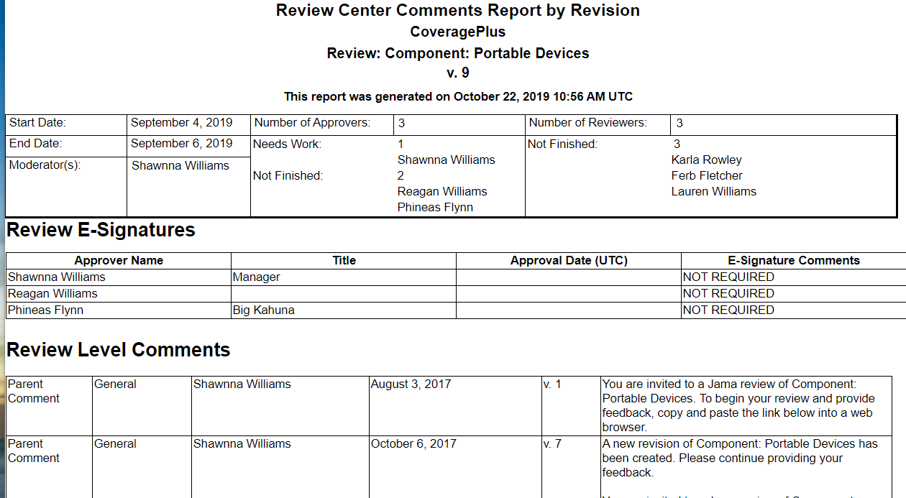
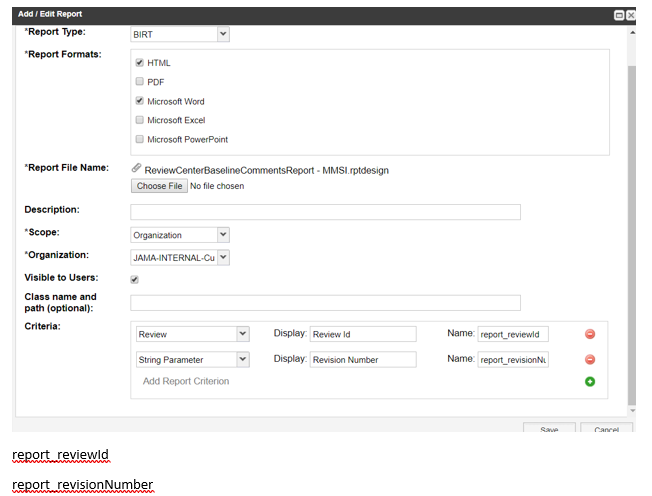

# Review Center Comments with Revision Signatures Report

## Description
The Review Center Comments report provides a summary of review information, review signatures, & associated comments.

## Preview Image

## Installation Instructions
1. Go to the Admin section of Jama
2. Click the Reports tab
3. Click Add Report
4. Fill in the Add/Edit Report form as shown below.
5. Click Save

## NOTES: 
- Your Organization field will have a different value.  
- Rename the report to anyting you like
- Enable any report format that you'd like to use

## Running the Report
1. Go to the Project section of Jama
2. Click Reports
3. Select the report name you specified when installing the report.
4. Select a review (the reviews in the list will be all of those reviews associated with the current project)
5. Click Run Report
