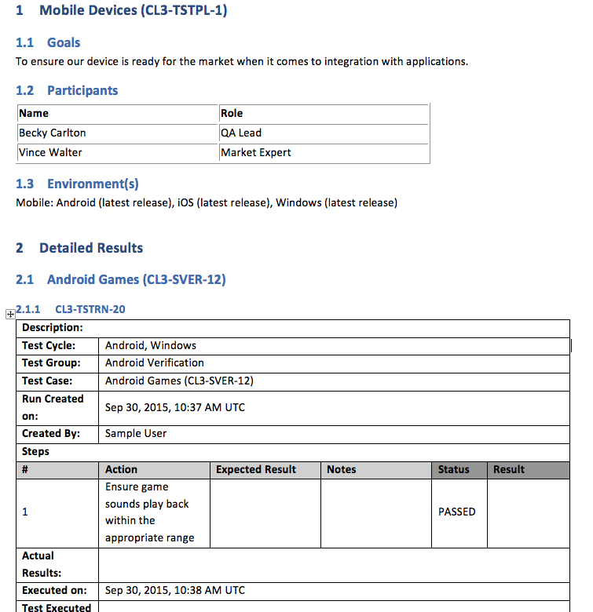
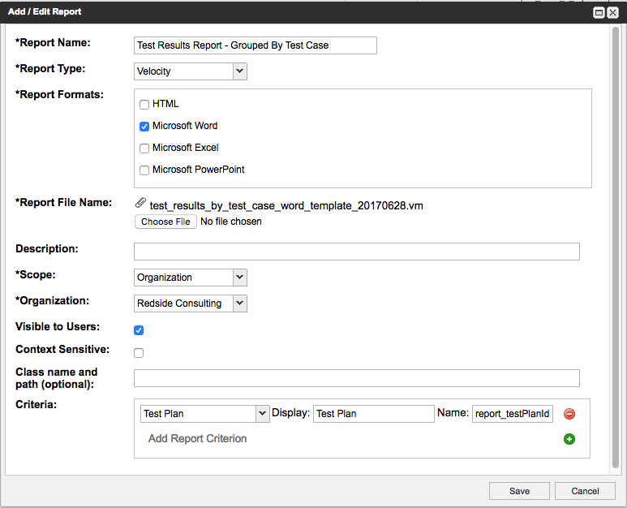

# Test Results Report - Grouped by Test Case

## Description
This report constructs a non-context sensitive test results report generating the information in your selected test plan. This includes the test plan overview then each test run result across all cycles grouped by matching test cases. 

## Preview Image

## Installation Instructions
1. Go to the Admin section of Jama
1. Click the Reports tab
1. Click Add Report
1. Fill in the Add/Edit Report form as shown below.
1. Click Save

## NOTES: 
- Your Organization field will have a different value.  
- Rename the report to anything you like

## Running the Report
1. Go to the Project section of Jama
1. Click into the non-context sensitive reports menu option in the top right of the instance
1. Select the report name you specified when installing the report.
1 Select a test plan (the test plans in the list will be all of those  associated with the current project)
1. Click Run Report
